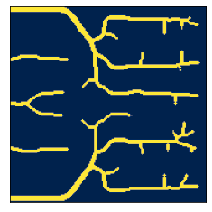
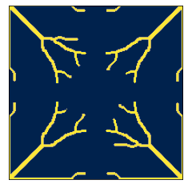
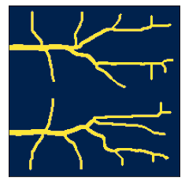
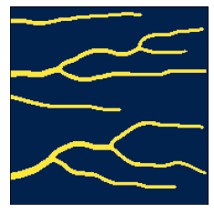
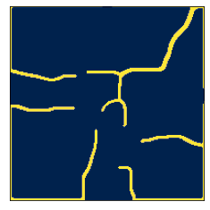
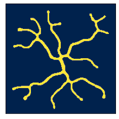
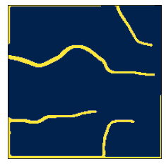

# Improving Solar Cell Designs using Convolutional Neural Networks

**Sumit Bhattacharya , Devanshu Arya , Debjani Bhowmick , Rajat Mani Thomas , Deepak Kumar Gupta**

#### Abstract
Topology Optimization has been a very popular method for optimizing physical structures. This has also been extended to the domains of Heat Flow and Solar Cell design problems. But, the performance is dependent on proper selection of parameters to be optimized. Better designs with better performance have been obtained with the use of Deep Learning in structural optimization. Metallization designs for Solar Cells obtained by topology optimization tend to give good efficiency. However,very limited use of deep learning has been made in optimizing Solar Cell metallization patterns. In this paper, we present the use of Convolutional Neural Networks without any training data to obtain more robust and efficient designs.

#### Method
Solar Cell Metallization problem is a non-linear optimization task. It can be formulated as a minimization task ,with density variable lying between 0 and 1, and no volume constraint. Those densities are then used to compute the loss ( in our case, the loss is negative of output power), which required to be minimized. Conventionally, the density variables are optimized using algorithms like MMA and OC. 

We have tried to reparameterize the domain of variables to be optimized. We have employed a Convolutional Neural Network (CNN) , to output the density variables. Here, we try to optimize the weights and the biases of the CNN , to produce such values of density variables that will give us maximum efficiency (minimum loss).

This is a schematic diagram of our optimization process

   
   
   
   
   
   #### Experiments 
   We standardized 4 sets of configurations of a Solar Cell with different settings and compared the performance of MMA and CNN (with LBFGS optimizer) on each.
   
     Type 1 - Vbus at the left edge of the cell
     Type 2 - Vbus at 4 corners of the cell
     Type 3 - Vbus at the centre of the cell
     Type 4 - Vbus at a portion of the left edge

<table>
  <tr>
     <td>MMA</td>
    <td valign="top"></td>
    <td valign="top"></td>
    <td valign="top"></td>
    <td valign="top"></td>
  </tr>
   <tr>
      <td>CNN</td>
    <td valign="top"></td>
    <td valign="top"></td>
    <td valign="top"></td>
    <td valign="top"></td>
  </tr>
 </table>
