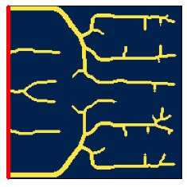
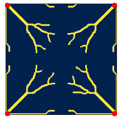
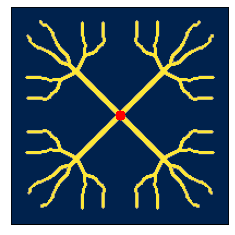
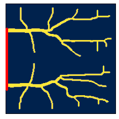
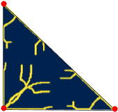
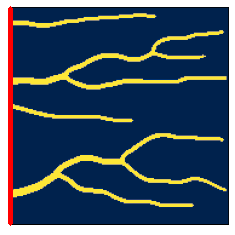
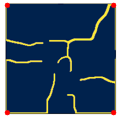
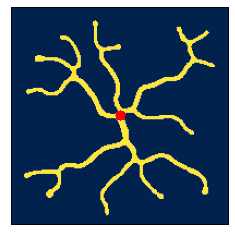
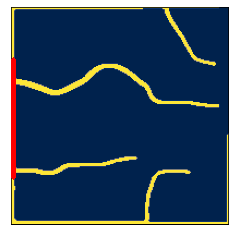
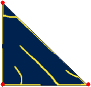

# SolarNet : Improving Solar Cell Designs using Convolutional Neural Networks 

**Sumit Bhattacharya , Devanshu Arya , Debjani Bhowmick , Rajat Mani Thomas , Deepak Kumar Gupta**

## Abstract
Topology Optimization (TO) has been a very popular method for optimizing physical structures. This has also been extended to the domains of Heat Flow and Solar Cell design problems. But, the performance is dependent on proper selection of parameters to be optimized. Better designs with better performance have been obtained with the use of Deep Learning in structural optimization. Metallization designs for Solar Cells obtained by topology optimization tend to give good efficiency. However,very limited use of deep learning has been made in optimizing Solar Cell metallization patterns. Here, we present the use of Convolutional Neural Networks (CNN) without any training data to obtain more robust and efficient designs.

## Motivation
Recent works have shown that TO has been successfully applied to find optimal metallization of solar cells to improve thier performance. Another [work](https://github.com/google-research/neural-structural-optimization) demonstrated the successful use of CNN to obtain better designs for Structural Optimization.
This project is an adaptation of their paper and is an extension of their work into the sphere of Non-linear optimization problems, Solar Cell Metallization being one of them.

## Method
Solar Cell Metallization problem is a non-linear optimization task. It can be formulated as a minimization task ,with density variable lying between 0 and 1, and no volume constraint. Those densities are then used to compute the loss ( in our case, the loss is negative of output power), which is required to be minimized. Conventionally, the density variables are optimized using algorithms like Method of Moving Asymptote(MMA) and Optimality Criteria(OC). 

We have tried to reparameterize the domain of variables to be optimized. For this, we employed a Convolutional Neural Network (CNN) , to  obtain  density variables as output. Here, we try to optimize the weights and the biases of the CNN , to produce such values of density variables that will give us maximum efficiency (minimum loss).

Here is a schematic diagram of our optimization process

   
   
   
   
 
 ### Notebooks 
 
 We have provided all-in-one Jupyter Notebooks for our experiments with SolarNet. For the sake of easy demonstration, we also provide here the notebook for Heat Conduction Problem which, by virtue, is a linear optimization problem.
All the notebooks were run in Colaboratory.
   
   
## Experiments and Resutls
   We standardized 4 sets of configurations of a Solar Cell with different settings and compared the performance of MMA and CNN (with LBFGS optimizer) on each.
   We also investigated the effect of Grid Resolution, Filter Radius and Cell Size.
   
     Type 1 : Vbus at the left edge of the cell  
     
     Type 2 : Vbus at 4 corners of the cell  
     
     Type 3 : Vbus at the centre of the cell   
     
     Type 4 : Vbus at a portion of the left edge
     
     Type 5 : Vbus at 3 corners of a triangular frame
     

<table>
   <tr>
      <td> Model  </td>
      <td> Type 1 </td>
      <td> Type 2 </td>
      <td> Type 3 </td>
      <td> Type 4 </td>
      <td> Type 5 </td>
   </tr>
  <tr>
     <td>MMA</td>
    <td valign="top"></td>
    <td valign="top"></td>
    <td valign="top"></td>
    <td valign="top"></td>
    <td valign="top"></td>
  </tr>
   <tr>
      <td>CNN</td>
    <td valign="top"></td>
    <td valign="top"></td>
    <td valign="top"></td>
    <td valign="top"></td>
    <td valign="top"></td>
  </tr>
 </table>
 
   Efficiency percentage obtained for a set of designs ( radius of filter = 1.5 element width , grid resolution 200x200 , cell size = 1.5cm x 1.5cm, Vbus =0.50)
 
 | Optimizer | Type 1 | Type 2 | Type 3 | Type 4 |  Type 5 |
 |-----------|--------|--------|--------|--------| --------|
 |   MMA     | 12.20  |  12.05 |  11.98 | 12.55  |  12.31  |
 |   CNN     | 12.34  |  12.47 |  12.25 | 12.64  |  12.67  |
  
   These efficiency values are obtained by converting the designs to complete black and white image ( 0 representing no electrode and 1 representing presence of electrode) with a threshold of 0.02. The CNN designs tend to have less grayness compared to the MMA counterparts. So, the overall efficiency values of the CNN designs are higher than those of MMA post processing.
   
## Libraries Used
- Autograd
- Dataclass
- Matplotlib
- Numpy
- Scipy
- Typing
- Tensorflow 2.0
- Xarray

### Useful Links
- Refer [dkgupta90/topsol](https://github.com/dkgupta90/topsol) for Matlab implementation of TO for Solar Cell Metallization
- Refer [ google-research/neural-structural-optimization ](https://github.com/google-research/neural-structural-optimization) for CNN Reparameterization to solve linear problems like Structural Optimization
 
